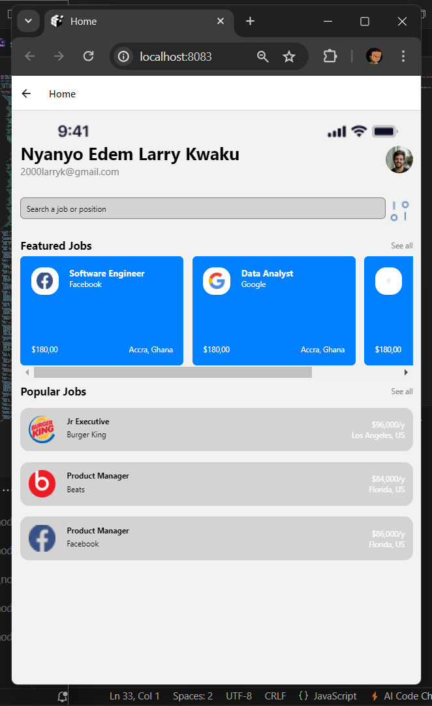

# DCIT202 MOBILE APPLICATION DEVELOPMENT - Assignment 4

## Overview

This project is an assignment for recreating a UI mockup for a mobile application using React Native. The application features a login screen and a home screen displaying job listings. The project requirements include passing data between screens, creating and using custom components, and closely matching the provided UI design.

## Table of Contents

- [Overview](#overview)
- [Table of Contents](#table-of-contents)
- [Screenshots](#screenshots)
- [Installation](#installation)
- [Usage](#usage)
- [Components](#components)
- [Contributing](#contributing)

## Screenshots

### Login Screen


### Home Screen


## Installation

To run this project, follow these steps:  

1. Clone the repository:
   ```bash
   git clone https://github.com/Edemowns/-rn-assignment4-11052329.git
